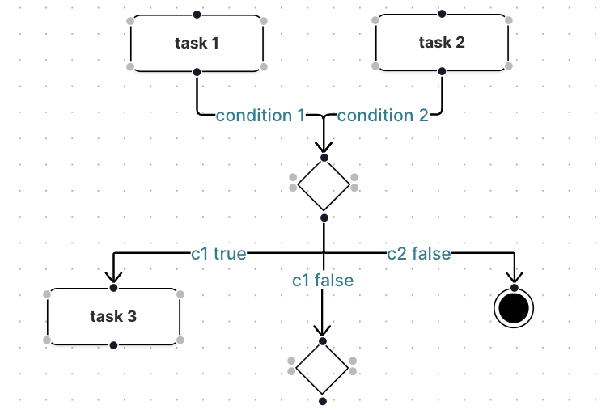

# Black-Box Testing: Evaluating Response Behavior of POST New Model and Model Validation on EMF.cloud Server

The purpose of black-box testing is to assess the construct validity of the decision to utilize the EMF.cloud server for validating models within the ExtremeXP graphical editor.
The assumption is that if an **instance model** (i.e., the concrete model that conforms to the meta-model) **violates** the rules defined in the **associated meta-model**, the EMF.cloud server will **reject** the POST request to create this instance model on the server.

## Expected Requiments

This section enumerates the expected behavior provided by the EMF.cloud Server's POST new model API.

- **R01-POST-SUCCESS-RESPONSE**:
  A successful model post indicates that the model has been created and stored on the server. If a model is successfully posted to the server, the server shall return a response containing the information about the successful post. This enables the user to be notified of the successful post.

- **R02-POST-FAILURE-RESPONSE**:
  A failed model post indicates that the model was unable to be created and stored on the server. If a model post fails, the server shall respond to notify the user about the failure.

- **R03-POST-MODEL-CONSISTENCY**:
  If the model is successfully created and stored on the server via the new model POST endpoint, the stored model should be consistent with the model posted by the client. This consistency entails ensuring that there are no missing or additional instances between the posted and ultimately created model.

- **R04-POST-MODEL-VALIDATION**:
  The server shall reject the model creation request under the following circumstances:

  - **R04A-REJECT-SCHEMA-VIOLATION**:
    If the instance model violates the schema defined in the meta-model, the server shall reject the model creation request. Schema violations include:

    1. **Element Violation:** The model contains an element (e.g., Classifier, including classes, data types, enumerations, and type parameters) that is not defined in the meta-model.
    2. **Relationship Violation:** The model contains relationships between elements that are not consistent with the relationships defined in the meta-model.

  - **R04B-REJECT-CONSTRAINTS-VIOLATION**:
    If the instance model violates the constraints defined by the meta-model, the server shall reject the model creation request. Constraints consist of additional rules such as **multiplicity**, and **data type**.

## Test Cases

For readability and privacy reasons, _\<workspace>_ is used to indicate the correct path that stores the meta-model in the EMF.Cloud server and _\<wrong workspace>_ is used to indicates a wrong path in this section.

#### Test ID: TC01-CORRECT-MODEL

**Test Requirement:**

- R01-POST-SUCCESS-RESPONSE
- R03-POST-MODEL-CONSISTENCY

**Input Features:**

| Input Feature                 | Compliance | Description                                                                                   |
| :---------------------------- | :--------: | :-------------------------------------------------------------------------------------------- |
| Correct Ecore model reference |  &#10003;  | The instance model refers to the correct position that stores the meta-model.                 |
| Correct elements              |  &#10003;  | All elements in the instance model follows the element name defined in the meta-model.        |
| Correct relationships         |  &#10003;  | The instance model follows the relathionship defined in the meta-model.                       |
| Correct multiplicity          |  &#10003;  | The elements in the instance model follows the correct multiplicty defined in the meta-model. |
| Correct data type             |  &#10003;  | The parameters in each element has the correct data type defined in the meta-model.           |

**Test input:**

```json
{
  "data": {
    "$type": "<workspace>/workflow.ecore#//Workflow",
    "$id": "/",
    "node": [
      {
        "$type": "<workspace>/workflow.ecore#//Task",
        "$id": "//@node.0",
        "name": "Task"
      },
      {
        "$type": "<workspace>/workflow.ecore#//EventNode",
        "$id": "//@node.1",
        "name": "START"
      },
      {
        "$type": "<workspace>/workflow.ecore#//EventNode",
        "$id": "//@node.2",
        "name": "END"
      }
    ],
    "link": [
      {
        "$type": "<workspace>/workflow.ecore#//RegularLink",
        "$id": "//@link.0",
        "output": {
          "$type": "<workspace>/workflow.ecore#//Task",
          "$ref": "//@node.0"
        },
        "input": {
          "$type": "<workspace>/workflow.ecore#//EventNode",
          "$ref": "//@node.1"
        }
      },
      {
        "$type": "<workspace>/workflow.ecore#//RegularLink",
        "$id": "//@link.1",
        "output": {
          "$type": "<workspace>/workflow.ecore#//EventNode",
          "$ref": "//@node.2"
        },
        "input": {
          "$type": "<workspace>/workflow.ecore#//Task",
          "$ref": "//@node.0"
        }
      }
    ]
  }
}
```

**Corresponding Graph:**

<br>


**Expected Outcome:**

- The expected outcome is an HTTP response with a status code equal to 200.
- The response payload should contain a message indicating that the model was successfully created
- The response payload should contain the created model stored on the EMF.cloud server.
- The returned model should have exactly the same elements as those contained in the posted model.

**Actual Outcome:**

```json
// Status Code: 200
{
  "type": "success",
  "data": {
    "$type": "<workspace>/workflow.ecore#//Workflow",
    "$id": "/",
    "node": [
      {
        "$type": "<workspace>/workflow.ecore#//Task",
        "$id": "//@node.0",
        "name": "task"
      },
      {
        "$type": "<workspace>/workflow.ecore#//EventNode",
        "$id": "//@node.1"
      },
      {
        "$type": "<workspace>/workflow.ecore#//EventNode",
        "$id": "//@node.2",
        "name": "END"
      }
    ],
    "link": [
      {
        "$type": "<workspace>/workflow.ecore#//RegularLink",
        "$id": "//@link.0",
        "output": {
          "$type": "<workspace>/workflow.ecore#//Task",
          "$ref": "//@node.0"
        },
        "input": {
          "$type": "<workspace>/workflow.ecore#//EventNode",
          "$ref": "//@node.1"
        }
      },
      {
        "$type": "<workspace>/workflow.ecore#//RegularLink",
        "$id": "//@link.1",
        "output": {
          "$type": "<workspace>/workflow.ecore#//EventNode",
          "$ref": "//@node.2"
        },
        "input": {
          "$type": "<workspace>/workflow.ecore#//Task",
          "$ref": "//@node.0"
        }
      }
    ]
  }
}
```

**Test Result:**

- &#10003; Status code 200
- &#10003; Message indicates successful upload
- &#10003; Response contains model created in the server
- &#10008; Returned model is consistent with the posted one

The model stored in the model in the test case is almost consistent with the posted model, except it removes the name of one EventNode that has the name "START". "START" is the default value for the name attribute of the EventNode class.

**Test Conclusion:**

- **R01-POST-SUCCESS-RESPONSE: PASS**
- **R03-POST-MODEL-CONSISTENCY: FAIL**

---

#### Test ID: TC02-INCORRECT-REFERENCE

**Test Requirement:**

- R02-POST-FAILURE-RESPONSE

**Input Features:**

| Input Feature                 | Compliance | Description                                                                         |
| :---------------------------- | :--------: | :---------------------------------------------------------------------------------- |
| Correct Ecore model reference |  &#10008;  | The instance model refers to the **incorrect position** that stores the meta-model. |

**Test Input:**

```json
{
  "data": {
    "$type": "<wrong workspace>/workflow.ecore#//Workflow",
    "$id": "/",
    "node": [
      {
        "$type": "<workspace>/workflow.ecore#//Task",
        "$id": "//@node.0",
        "name": "task"
      }
    ]
  }
}
```

**Expected Outcome**:

- The HTTP response should has an Error status code.
- The repsonse should contain an error message to indicate the type of error.

**Actual Outcome:**

```json
// Status Code: 200
```

**Test Result:**

- &#10008; Response returns error status code
- &#10008; Response returns error message

The response contains a status code of 200, indicating an OK status. However, the post resulted in a failure, and nothing is stored on the server. The incorrect meta-model reference caused an internal server error, which is displayed in the server console:

`Caused by: java.io.FileNotFoundException: <wrong workspace>/workflow.ecore (No such file or directory)`.

However, the client cannot retrieve this information from the HTTP response alone.

**Test Conclusion:**

- **R02-POST-FAILURE-RESPONSE: FAIL**

---

#### Test ID: TC03-NON-EXISTING-ELEMENT-NAME

**Test Requirement:**

- R04A-REJECT-SCHEMA-VIOLATION

**Input Features:**

| Input Feature    | Compliance | Description                                                                                                 |
| :--------------- | :--------: | :---------------------------------------------------------------------------------------------------------- |
| Correct elements |  &#10008;  | One of the **element** in the instance model uses the class name that is **not defined** in the meta-model. |

**Test Input:**

```json
// CompositeTask is not defined
{
  "data": {
    "$type": "<workspace>/workflow.ecore#//Workflow",
    "$id": "/",
    "node": [
      {
        "$type": "<workspace>/workflow.ecore#//CompositeTask",
        "$id": "//@node.0",
        "name": "task"
      },
      {
        "$type": "<workspace>/workflow.ecore#//EventNode",
        "$id": "//@node.1",
        "name": "START"
      },
      {
        "$type": "<workspace>/workflow.ecore#//EventNode",
        "$id": "//@node.2",
        "name": "END"
      }
    ]
  }
}
```

**Expected Outcome:**

- The server should reject this post and do not store the model in the server.
- The response should contain an error message to explain the failure.

**Actual Outcome:**

```json
{
  "type": "success",
  "data": {
    "$type": "<workspace>/workflow.ecore#//Workflow",
    "$id": "/",
    "node": [
      {
        "$type": "<workspace>/workflow.ecore#//EventNode",
        "$id": "//@node.0"
      },
      {
        "$type": "<workspace>/workflow.ecore#//EventNode",
        "$id": "//@node.1",
        "name": "END"
      }
    ]
  }
}
```

**Test Result:**

- &#10008; Reject model creation request.
- &#10008; Error message.

The server does not reject model creation requests even if the model contains elements that do not exist in the meta-model. Instead, it **deletes the undefined elements** and stores the model without the violated elements.

**Test Conclusion:**

- **R04A-REJECT-SCHEMA-VIOLATION: FAIL**
- **R03-POST-MODEL-CONSISTENCY: FAIL**

---

#### Test ID: TC04-INCORRECT-ELEMENT-USEAGE

**Test Requirement:**

- R04A-REJECT-SCHEMA-VIOLATION

**Input Features:**

| Input Feature    | Compliance | Description                                                                                                                           |
| :--------------- | :--------: | :------------------------------------------------------------------------------------------------------------------------------------ |
| Correct elements |  &#10008;  | One of the element in the instance model is **an abstract element** defined in the meta-model but instantiated in the instance model. |

**Test Input:**

```json
// Node is an abstract class.
{
  "data": {
    "$type": "<workspace>/workflow.ecore#//Workflow",
    "$id": "/",
    "node": [
      {
        "$type": "<workspace>/workflow.ecore#//Node",
        "$id": "//@node.0"
      },
      {
        "$type": "<workspace>/workflow.ecore#//EventNode",
        "$id": "//@node.1",
        "name": "START"
      },
      {
        "$type": "<workspace>/workflow.ecore#//EventNode",
        "$id": "//@node.2",
        "name": "END"
      }
    ]
  }
}
```

**Expected Outcome:**

- The server should reject the post request.
- The response shows the error message.

**Actual Outcome:**

```json
// Status code: 200.
```

**Test Result:**

- &#10003; The server rejects the post request.
- &#10008; Error message.

The inproper use of element results in server internal error:
`[JettyServerThreadPool-34] ERROR DefaultModelSynchronizer-1 - Execution Exception
java.util.concurrent.ExecutionException: java.lang.IllegalArgumentException: The class 'Node' is not a valid classifier`

However, the client can not retrieve this information from the HTTP response. The reponse only gives a 200 status ok without any payload.

**Test Conclusion:**

- **R04A-REJECT-SCHEMA-VIOLATION: PASS**

---

#### Test ID: TC05-NON-EXISTING-RELATIONSHIP

**Test Requirement:**

- R04A-REJECT-SCHEMA-VIOLATION

**Input Features:**

| Input Feature         | Compliance | Description                                                                     |
| :-------------------- | :--------: | :------------------------------------------------------------------------------ |
| Correct relationships |  &#10008;  | The **relationship** in the instance model **does not exist** in the meta-model |

**Test Input:**

```json
// "parameter" does not exist, the correct relation is "parameters"
{
  "data": {
    "$type": "<workspace>/workflow.ecore#//Workflow",
    "$id": "/",
    "node": [
      {
        "$type": "<workspace>/workflow.ecore#//Task",
        "$id": "//@node.0",
        "parameter": [
          {
            "$id": "//@node.0/@parameter.0",
            "name": "parameter 1"
          }
        ]
      }
    ]
  }
}
```

**Expected Outcome:**

- The server rejects the POST request.
- The response shows the error message.

**Actual Outcome:**

```json
// Status Code: 200
{
  "type": "success",
  "data": {
    "$type": "<workspace>/workflow.ecore#//Workflow",
    "$id": "/",
    "node": [
      {
        "$type": "<workspace>/workflow.ecore#//Task",
        "$id": "//@node.0"
      }
    ]
  }
}
```

**Test Result:**

- &#10008; The server rejects the post request.
- &#10008; The response contains an error message.

The server accepted the model and stored it. But the non-existing relationship is removed without notification.

**Test Conclusion:**

- **R04A-REJECT-SCHEMA-VIOLATION: FAIL**
- **R03-POST-MODEL-CONSISTENCY: FAIL**

---

#### Test ID: TC06-INCORRECT-RELATION-USEAGE

**Test Requirement:**

- R04A-REJECT-SCHEMA-VIOLATION

**Input Features:**

| Input Feature         | Compliance | Description                                                                |
| :-------------------- | :--------: | :------------------------------------------------------------------------- |
| Correct relationships |  &#10008;  | One of the **relationship** is **incorrectly used** in the instance model. |

**Test Input:**

```json
// link can not link between output data and task
{
  "data": {
    "$type": "<workspace>/workflow.ecore#//Workflow",
    "$id": "/",
    "outputs": [
      {
        "$id": "//@outputs.0",
        "name": "output data 1"
      }
    ],
    "node": [
      {
        "$type": "<workspace>/workflow.ecore#//Task",
        "$id": "//@node.0",
        "name": "task 1"
      }
    ],
    "link": [
      {
        "$type": "<workspace>/workflow.ecore#//RegularLink",
        "$id": "//@link.0",
        "output": {
          "$type": "<workspace>/workflow.ecore#//Task",
          "$ref": "//@node.0"
        },
        "input": {
          "$ref": "//@outputs.0"
        }
      }
    ]
  }
}
```

**Expected Outcome:**

- The server should reject the post request.
- The response contains an error message.

**Actual Outcome:**

```json
// Status code: 200.
```

**Test Result:**

- &#10003; The server rejects the post request.
- &#10008; Response contains error message.

The inproper use of element results in server internal error:
`[JettyServerThreadPool-29] ERROR DefaultModelSynchronizer-1 - Execution Exception
java.util.concurrent.ExecutionException: java.lang.ClassCastException: The value of type 'org.eclipse.emf.ecore.impl.EClassImpl@ab37fa8 (name: OutputData) (instanceClassName: null) (abstract: false, interface: false)' must be of type 'org.eclipse.emf.ecore.impl.EClassImpl@296cac8b (name: Node) (instanceClassName: null) (abstract: true, interface: false)`

However, the client can not retrieve this information from the HTTP response. The reponse only gives a 200 status ok without any information.

**Test Conclusion:**

- **R04A-REJECT-SCHEMA-VIOLATION: PASS**

---

#### Test ID: TC07-INCORRECT-MULTIPLICITY

**Test Requirement:**

- R04B-REJECT-CONSTRAINTS-VIOLATION

**Input Features:**

| Input Feature        | Compliance | Description                                                                                                                     |
| :------------------- | :--------: | :------------------------------------------------------------------------------------------------------------------------------ |
| Correct multiplicity |  &#10008;  | The element or relationship contained in the instance model **violates the multiplicity constraints** defined in the meta-model |

**Test Input**

```json
// A link can have [0...1] output, but the test case has 2 outputs
{
  "data": {
    "$type": "file:/Users/yunabell/Desktop/emfcloud-modelserver-extremexp/examples/org.eclipse.emfcloud.modelserver.example/.temp/workspace/workflow.ecore#//Workflow",
    "$id": "/",
    "node": [
      {
        "$type": "file:/Users/yunabell/Desktop/emfcloud-modelserver-extremexp/examples/org.eclipse.emfcloud.modelserver.example/.temp/workspace/workflow.ecore#//Task",
        "$id": "//@node.0",
        "name": "task 1"
      },
      {
        "$type": "file:/Users/yunabell/Desktop/emfcloud-modelserver-extremexp/examples/org.eclipse.emfcloud.modelserver.example/.temp/workspace/workflow.ecore#//Task",
        "$id": "//@node.1",
        "name": "task 2"
      },
      {
        "$type": "file:/Users/yunabell/Desktop/emfcloud-modelserver-extremexp/examples/org.eclipse.emfcloud.modelserver.example/.temp/workspace/workflow.ecore#//Task",
        "$id": "//@node.2",
        "name": "task 3"
      }
    ],
    "link": [
      {
        "$type": "file:/Users/yunabell/Desktop/emfcloud-modelserver-extremexp/examples/org.eclipse.emfcloud.modelserver.example/.temp/workspace/workflow.ecore#//RegularLink",
        "$id": "//@link.0",
        "output": {
          "$type": "file:/Users/yunabell/Desktop/emfcloud-modelserver-extremexp/examples/org.eclipse.emfcloud.modelserver.example/.temp/workspace/workflow.ecore#//Task",
          "$ref": "//@node.1"
        },
        "output": {
          "$type": "file:/Users/yunabell/Desktop/emfcloud-modelserver-extremexp/examples/org.eclipse.emfcloud.modelserver.example/.temp/workspace/workflow.ecore#//Task",
          "$ref": "//@node.2"
        },
        "input": {
          "$type": "file:/Users/yunabell/Desktop/emfcloud-modelserver-extremexp/examples/org.eclipse.emfcloud.modelserver.example/.temp/workspace/workflow.ecore#//Task",
          "$ref": "//@node.0"
        }
      }
    ]
  }
}
```

**Expected Outcome:**

- The server rejects the post request.
- The response contains error message.

**Actual Outcome:**

```json
{
  "type": "success",
  "data": {
    "$type": "<workspace>/workflow.ecore#//Workflow",
    "$id": "/",
    "node": [
      {
        "$type": "<workspace>/workflow.ecore#//Task",
        "$id": "//@node.0",
        "name": "task 1"
      },
      {
        "$type": "<workspace>/workflow.ecore#//Task",
        "$id": "//@node.1",
        "name": "task 2"
      },
      {
        "$type": "<workspace>/workflow.ecore#//Task",
        "$id": "//@node.2",
        "name": "task 3"
      }
    ],
    "link": [
      {
        "$type": "<workspace>/workflow.ecore#//RegularLink",
        "$id": "//@link.0",
        "output": {
          "$type": "<workspace>/workflow.ecore#//Task",
          "$ref": "//@node.2"
        },
        "input": {
          "$type": "<workspace>/workflow.ecore#//Task",
          "$ref": "//@node.0"
        }
      }
    ]
  }
}
```

**Test Result:**

- &#10008; The server rejects the post request.
- &#10008; Error message in response.

The server accpeted the post request and created the model in the server. If the multiplicity is violated, the **additional element overrides the previous one**.

**Test Conclusion:**

- **R04B-REJECT-CONSTRAINTS-VIOLATION: FAIL**
- **R03-POST-MODEL-CONSISTENCY: FAIL**

---

#### Test ID: TC08-INCORRECT-DATATYPE

**Test Requirement:**

- R04B-REJECT-CONSTRAINTS-VIOLATION

**Input Features:**

| Input Feature     | Compliance | Description                                                                               |
| :---------------- | :--------: | :---------------------------------------------------------------------------------------- |
| Correct data type |  &#10008;  | One of the **data type of the value of an attribute is incorrect** in the instance model. |

**Test Input**

```json
// data type of "isAbstract" should be boolean
{
  "data": {
    "$type": "<workspace>/workflow.ecore#//Workflow",
    "$id": "/",
    "node": [
      {
        "$type": "<workspace>/workflow.ecore#//Task",
        "$id": "//@node.0",
        "name": "task",
        "isAbstract": "hello"
      }
    ]
  }
}
```

**Expected Outcome:**

- The server should reject the post request.
- The response should contain the error message.

**Actual Outcome:**

```json
// Status Code: 500
{
  "type": "error",
  "data": "An error occurred during data decoding"
}
```

**Test Result:**

- &#10003; The server rejects the post request.
- &#10003; Response contains error message.

The server rejects the post and explains the reason of creation failure is due to data type error.

**Test Conclusion:**

- **R04B-REJECT-CONSTRAINTS-VIOLATION: PASS**

---

## Conclusion

The test cases evaluated the response behaviors of the EMF.cloud server under various violations of the instance model compared to the meta-model. Based on the test results, the following conclusions can be drawn:

1. If the instance model fully adheres to the meta-model, the EMF.cloud server creates a model identical to the one posted to the server and stores it. (_TC01-CORRECT-MODEL_)

2. If there are elements or relationships in the instance model that are not defined in the meta-model, the model can still be posted and stored in the server, but the non-existent elements or relationships will be removed. However, this deletion of instances does not trigger any notification in the HTTP response. (_TC03-NON-EXISTING-ELEMENT-NAME_, _TC05-NON-EXISTING-RELATIONSHIP_)

3. If multiplicity constraints are violated, the instance model can still be successfully posted into the server, but the additional element that violates the multiplicity will overwrite other elements. (_TC07-INCORRECT-MULTIPLICITY_)

4. If the data type of an attribute in the instance model is incorrectly used, the server rejects the post request and returns an error message that explicitly explains the error type. (_TC08-INCORRECT-DATATYPE_)

5. The server encounters an internal error under the following scenarios:
   - Incorrect reference to the meta-model. (_TC02-INCORRECT-REFERENCE_)
   - Incorrect instantiation of an element. (_TC04-INCORRECT-ELEMENT-USEAGE_)
   - Violation of the relationship between two elements in the schema. (_TC06-INCORRECT-RELATION-USEAGE_)
     For these errors, the HTTP request returns a Status Code 200 without any additional information.

It is evident that these types of errors are unlikely to be caused by graphs drawn in the graphical editor but rather by the conversion of the graphical model to the EMF model. Although most of the expected requirements did not pass the tests, developers working on the model conversion can still distinguish between a fully successful model posting, a posting failure, and a posting with flaws. Therefore, **the EMF.cloud server can be considered a powerful tool to verify the correctness of the conversion output**.

However, since many constraints to limit model creation are not defined in the meta-model initially, users of the graphical model editor may create models beyond our expectations.

**Example 1: workflow without start or end node**

<br>


**Example 2: exclusive operator has more than one input and two outputs**

<br>



These models can be successfully posted to the EMF.cloud server and pass all validations because the constraints are not defined. Nevertheless, such **constraints can be validated in the front end** or OCL can be added in future works to restrict user behavior.
